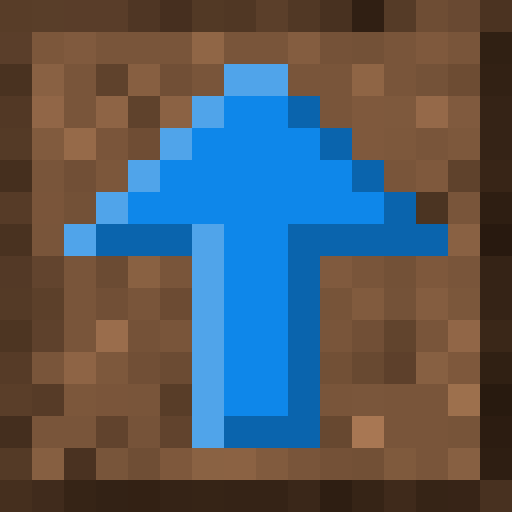

# Flowing Background

  

[Downloads](https://github.com/Juuxel/FlowingBackground/releases)

&nbsp;

*Flowing Background* makes the dirt texture behind
screens flow upwards like in [Indev](https://minecraft.gamepedia.com/File:EarlyIndevTitle.gif).
